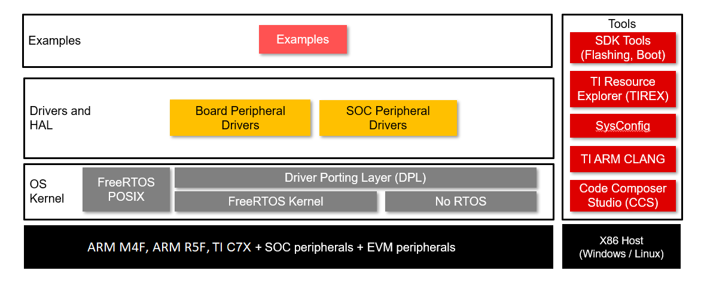

<div align="center">

<br/>
# MCU+ SDK

[Introduction](#introduction) | [Features](#features) | [Overview](#overview)

</div>

## Introduction

MCU+ SDK is a software development package designed for usage with Sitara MPU/MCU+ class of devices from Texas Instruments. This repository provides MCU+SDK support the following list of Sitara MPU devices.

- [AM623](https://www.ti.com/product/AM623), [AM625](https://www.ti.com/product/AM625), [AM620-Q1](https://www.ti.com/product/AM620-Q1), [AM625-Q1](https://www.ti.com/product/AM625-Q1)
- [AM62A3](https://www.ti.com/product/AM62A3), [AM62A3-Q1](https://www.ti.com/product/AM62A3-Q1), [AM62A7](https://www.ti.com/product/AM62A7), [AM62A7-Q1](https://www.ti.com/product/AM62A7-Q1)
- [AM62P](https://www.ti.com/product/AM62P)

Go to [MCU+SDK Core repository](https://github.com/TexasInstruments/mcupsdk-core) for other devices.

MCU+ SDK is designed with user experience and simplicity in mind. The SDK includes out-of-box application examples and peripheral usage examples to help users hit the ground running.

## Features

- Out of Box peripheral Examples
  - Peripheral Level Examples: UART, ADC, I2C, SPI etc.

- Protocol stacks and middleware
  - FreeRTOS-FAT

- Drivers and Hardware Abstraction Layer
  - Board peripheral drivers - Flash, EEPROM, LED etc.
  - SoC peripheral drivers - I2C, SPI, OSPI, ADC etc.

- OS kernel layer
  - Driver Porting Layer(DPL) which acts as an abstraction layer between driver and OS
  - Out of Box Support for
    - FreeRTOS
    - Baremetal i.e NO RTOS builds

## Overview

---



---

MCU+ SDK source comprises of multiple repositories with the current repository
at it's core. To build the SDK successfully, there are other repositories
that need to be cloned and are listed below:

- [FreeRTOS-Kernel](https://github.com/TexasInstruments/mcupsdk-FreeRTOS-Kernel)
- [FreeRTOS-POSIX](https://github.com/TexasInstruments/mcupsdk-FreeRTOS-POSIX)
- [FreeRTOS-FAT](https://github.com/TexasInstruments/mcupsdk-FreeRTOS-FAT)

We use the [repo tool](https://gerrit.googlesource.com/git-repo) to clone and manage
multiple repositories. To setup the repo tool, navigate to [repo tool setup](#repo-tool-setup) section.

Prebuilt SDK installers  for specific devices are available at below links. Please note that installers are packaged specific to each device to reduce size.

- [AM62X MCU+ SDK](https://www.ti.com/tool/download/MCU-PLUS-SDK-AM62X)
- [AM62A MCU+ SDK](https://www.ti.com/tool/download/MCU-PLUS-SDK-AM62A)
- [AM62P MCU+ SDK](https://www.ti.com/tool/download/MCU-PLUS-SDK-AM62P)

## Usage

### Prerequisites

#### Supported HOST environments

- Ubuntu 22.04 64bit

### Clone and build from GIT

#### Repo Tool Setup

MCU+ SDK has multiple components (in multiple repositories) and dependencies
(like compiler, CCS and other tools). We use repo tool from Google to manage these
multiple repositories. Follow the below mentioned steps to setup repo tool:

Make sure [python3 is installed](https://wiki.python.org/moin/BeginnersGuide/Download) and is in your OS path.

- Linux:
  ```bash
  sudo apt-get update
  sudo apt-get install repo
  ```

#### Cloning The Repositories

To clone the repositories using repo tool, do below in your workarea folder:

Note that depending on the SoC you're working with, the components you clone might be
slightly different. So please choose the manifest folder according to the SoC of your
interest. For example, we are showing for am62ax below.

```bash
repo init -u https://github.com/TexasInstruments/mcupsdk-manifests.git -m am62ax/dev.xml -b k3_main
```

To download the recent tag,

```bash
repo init -u https://github.com/TexasInstruments/mcupsdk-manifests.git -m am62ax/main.xml -b k3_main
```

After the repo is initialized, do a

```bash
repo sync
```

This should clone all the repositories required for MCU+ SDK development. Now download and install the dependencies.

#### Downloading And Installing Dependencies

Note that the dependencies are also soc specific, here we take an example of am62ax.
You can replace that with the SoC of your choice like the `repo init` step.

**To download and install dependencies in linux, follow the below steps**:

Run the following from the same location where you have `mcu_plus_sdk` and `mcupsdk_setup`
folders.

```bash
find ./mcupsdk_setup -name "*.sh" -execdir chmod u+x {} +
./mcupsdk_setup/am62ax/download_components.sh
```

This will install all the required dependencies including Code Composer Studio (CCS).
The script assumes that `mcu_plus_sdk` folder is in the same location from where
you have invoked the script, and that dependencies are installed into `${HOME}/ti`
location. 

Set up node modules by running below commands
```bash
cd mcu_plus_sdk
npm ci
cd ..
```
**To install the dependancies manually, follow the steps below**:

1. Download and install Code Composer Studio v12.6 from [here](https://www.ti.com/tool/download/CCSTUDIO "Code Composer Studio")
   - Install at default folder, $HOMEC/ti

2. Download and install SysConfig 1.19.0 from [here](https://www.ti.com/tool/download/SYSCONFIG "SYSCONFIG")
   - Install at default folder, $HOMEC/ti

3. Download and install ARM-CGT-CLANG 3.2.2 from [here](https://www.ti.com/tool/download/ARM-CGT-CLANG "ARM-CGT-CLANG")
   - Install at default folder, $HOMEC/ti

3. Download and install GCC for Cortex A53 and ARM R5 from below link
   - [GNU-A](https://developer.arm.com/-/media/Files/downloads/gnu-a/9.2-2019.12/binrel/gcc-arm-9.2-2019.12-mingw-w64-i686-aarch64-none-elf.tar.xz)
   - [GNU-RM](https://developer.arm.com/-/media/Files/downloads/gnu-rm/7-2017q4/gcc-arm-none-eabi-7-2017-q4-major-win32.zip)
   - Install at default folder, $HOMEC/ti

4. Download and install Node.js v12.18.4 LTS
  - Go to the [NodeJS Website](https://nodejs.org/en/) and use the installer to
    download and install v12.18.4 of node. Install in the default directory.
  - After successful installation, run an `npm ci` inside the `mcu_plus_sdk` folder like so:
    ```bash
    $ cd mcu_plus_sdk/
    $ npm ci
    $ cd ../
    ```
    This should install the node packages required for the SDK.

1. Download and install doxygen,
   - Tested with 1.8.20
     - Download the correct version of doxygen for windows from [here](https://www.doxygen.nl/download.html)
     - Install and add the install path, typically, C:/Program Files/doxygen/bin to your windows PATH
   - Test by doing below on the command prompt
     ```
     $ doxygen -v
     1.8.20 (<commit SHA-ID>)
     ```

**Installing OpenSSL**

Some of the SDK signing scripts are dependent on OpenSSL v1.1.1. The v1.1.1 is
important, OpenSSL 3.0 is not compatible with the current signing scripts of SDK.

In Linux,
  - There is a chance that OpenSSL is already installed. If not, here are the steps:
  - If you have Ubuntu 22.04, do below in Linux Ubuntu shell to install openssl
    -`$ sudo apt install openssl`

    If you have an Ubuntu version higher than that, make sure that you install the 1.1.1 version.
    You can get the 1.1.1 packages from [here](http://security.ubuntu.com/ubuntu/pool/main/o/openssl/).
    The packages required are openssl, libssl and libssl-dev

Test openssl version by running `openssl version` on a command prompt and make sure there is no error.
Example output is shown below,

```bash
  $ openssl version
  OpenSSL 1.1.1k  25 Mar 2021
```

Now that the dependencies are installed, you can start the repositories with a
default branch `dev` by doing below:

```bash
repo start dev --all
```

---

**NOTE**

- In Linux, you will need to run `$HOME/ti/ccs{version}/ccs/install_scripts/install_drivers.sh` script for setting COM
  port accesses correctly. Also add your user to groups `tty` and `dialout`. You can do

  ```
  sudo adduser $USER tty
  sudo adduser $USER dialout
  ```

- Please use the industrial communication libraries from the sdk installer due licensing restrictions.

---

### Building the SDK

#### Basic Building With Makefiles

---

**NOTE**

- Unless mentioned otherwise, all below commands are invoked from root folder of the "mcu_plus_sdk"  repository.
- Current supported device names are am62x, am62ax and am62px
- Pass one of these values to `"DEVICE="`
- You can also build components (examples, tests or libraries) in `release` or `debug`
  profiles. To do this pass one of these values to `"PROFILE="`

---

1. Run the following command to create makefiles, this step is optional since this is invoked as part of other steps as well,

   ```bash
   make gen-buildfiles DEVICE=am62ax
   ```

2. To see all granular build options, run

   ```bash
   make -s help DEVICE=am62ax
   ```
   This should show you commands to build specific libraries, examples or tests.

3. Make sure to build the libraries before attempting to build an example. For example,
   to build a Hello World example for AM62A, run the following:
   ```bash
   make -s -j4 libs DEVICE=am62ax PROFILE=debug
   ```
   Once the library build is complete, to build the example run:
   ```bash
   make -s -C examples/hello_world/am62ax-sk/mcu-r5fss0-0_nortos/ti-arm-clang all PROFILE=debug
   ```

4. Following are the commands to build **all libraries** and **all examples**. Valid PROFILE's are "release" or "debug"

   ```bash
   make -s -j4 clean DEVICE=am62ax PROFILE=debug
   make -s -j4 all   DEVICE=am62ax PROFILE=debug
   ```

### More information on SDK usage

For more details on SDK usage, please refer to the SDK userguide. User guides contain information on

- Building the SDK
- EVM setup,
- CCS Setup, loading and running examples
- Flashing the EVM
- SBL, ROV and much more.

Note that userguides are specific to a particular device. The links for all the supported devices are given below.

- [AM62X User Guide](https://software-dl.ti.com/mcu-plus-sdk/esd/AM62X/latest/exports/docs/api_guide_am62x/index.html)
- [AM62A User Guide](https://software-dl.ti.com/mcu-plus-sdk/esd/AM62AX/latest/exports/docs/api_guide_am62ax/index.html)
- [AM62P User Guide](https://software-dl.ti.com/mcu-plus-sdk/esd/AM62PX/latest/exports/docs/api_guide_am62px/index.html)

The documentation can also be generated as mentioned in the below section.

### Generate Documentation

- Goto mcu_plus_sdk and type below to build the documentation for the device of interest

  ```bash
  make docs DEVICE=am62ax
  ```

- Browse API guide by opening below file for a DEVICE of interest

  ```bash
  README_FIRST_*.html
  ```

- Also note that code snippets added to “docs_src\docs\api_guide\doxy_samples” is valid code that can compile.
  Above command also compiles the code snippets.

